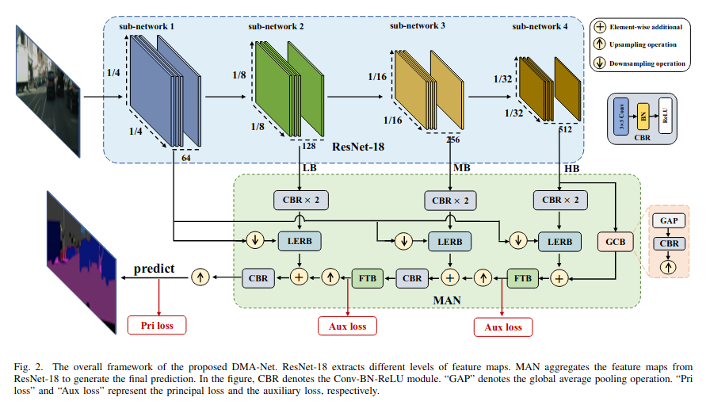
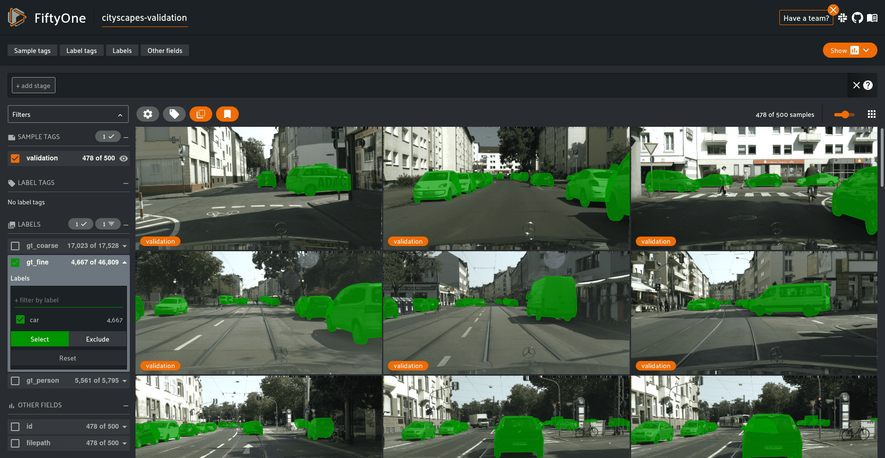

<div align="center">

# Deep Multi-Branch Aggregation Network for Real-Time Semantic Segmentation in Street Scenes

<a href="https://pytorch.org/get-started/locally/"></a>
<a href="https://pytorchlightning.ai/"></a>
<a href="https://hydra.cc/"></a>
<a href="https://github.com/ashleve/lightning-hydra-template"></a><br>
[](https://arxiv.org/abs/2203.04037)

</div>



This is an implementation of DMA-Net in Pytorch. The project is for my self exploration with Pytorch Lightning and Hydra tools and enhance my programming skills. DMA-Net is a real-time semantic segmentation network for street scenes in self-driving cars.

## Added Features

1. **D-Adaptaion Optmizers**
   Learning rate free learning for SGD, AdaGrad and Adam! by [facebookresearch/dadaptation/](https://github.com/facebookresearch/dadaptation)
   Simlply enable by using:
   ```
   model.auto_lr=True model.lr=1.0
   ```
2. **Hyperparameter Search**
   Since its hard to reproduce the result from the original author, I added 2 variables `high_level_features` and `low_level_features` to set the feature sizes in the model.

    - **high_level_features**: its the CBR (upmid_cbr) input size after addition ops between sub-network 3 and sub-network 4 in the upscaling pipeline.

    - **low_level_features**: its the CBR (uplow_cbr) input size after addition ops between sub-network 2 and upmid_cbr in the upscaling pipeline.
    ```
    model.net.low_level_features=128 model.net.high_level_features=128
    ```


# How to run
## Install dependencies

```bash
# clone project
git clone https://github.com/haritsahm/pytorch-DMANet.git
cd pytorch-DMANet

# [OPTIONAL] create conda environment
conda create -n myenv python=3.8
conda activate myenv

# install pytorch according to instructions
# https://pytorch.org/get-started/

# install requirements
pip install -r requirements.txt
```

### Prepare dataset

Run and follow the [notebook](notebooks/dataset-preparation.ipynb) to prepare and visualize dataset using Fiftyone



## Train model with default configuration

```bash
# train on CPU
python train.py trainer.gpus=0 data_dir=data/datasets/cityscapes/cityscape_fo_image_segmentation

# train on GPU
python train.py trainer.gpus=1 data_dir=data/datasets/cityscapes/cityscape_fo_image_segmentation
```

Train model with chosen experiment configuration from [configs/experiment/](configs/experiment/)

```bash
python train.py experiment=cityscape data_dir=data/datasets/cityscapes/cityscape_fo_image_segmentation
```

You can override any parameter from command line like this

```bash
python train.py experiment=cityscape data_dir=data/datasets/cityscapes/cityscape_fo_image_segmentation trainer.max_epochs=20 datamodule.batch_size=64 model.net.low_level_features=128 model.net.high_level_features=256
```

Track experiments with experiment trackers
```bash
python train.py data_dir=data/datasets/cityscapes/cityscape_fo_image_segmentation trainer.max_epochs=20 datamodule.batch_size=64 logger=neptune
```

Create a sweep over hyperparameters with Optuna
```
python train.py -m experiment=cityscape hparams_search=dmanet_optuna data_dir=data/datasets/cityscapes/cityscape_fo_image_segmentation
```


Read the full [documentation](docs/DOCS.md) on how to use pytorch-lightning + hydra

## TODO:
- [ ] Train model using cloud instances
- [ ] Validate and compare model metrics (cityscapes and camvid)
